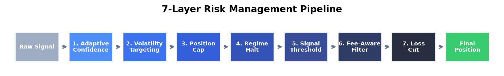
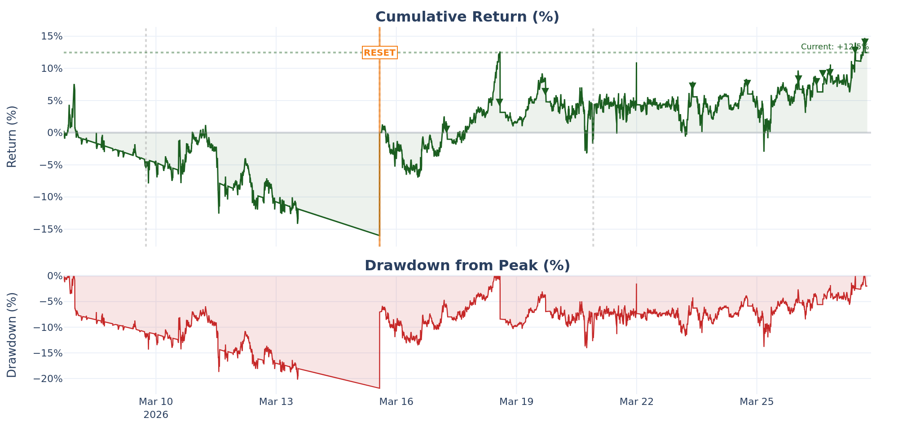
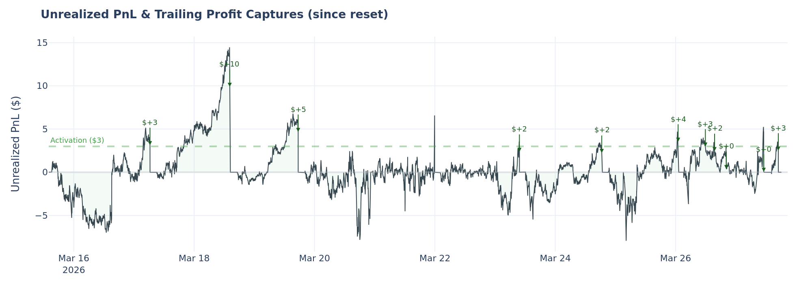
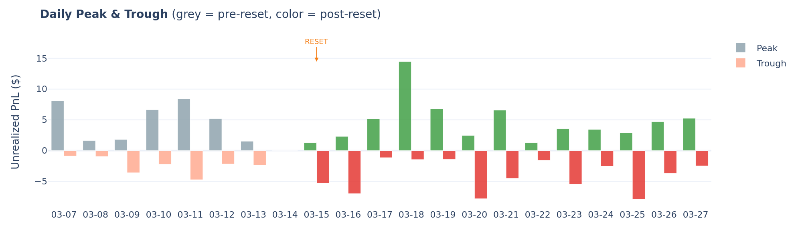
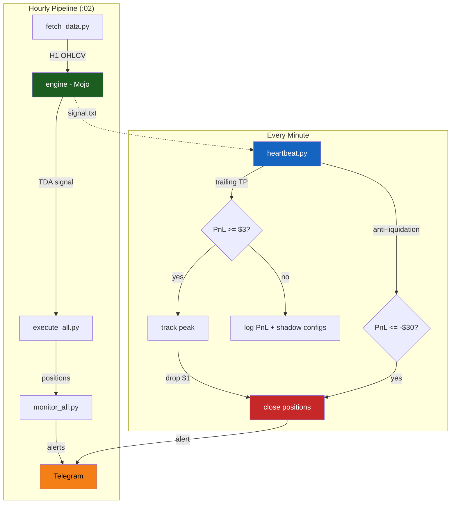
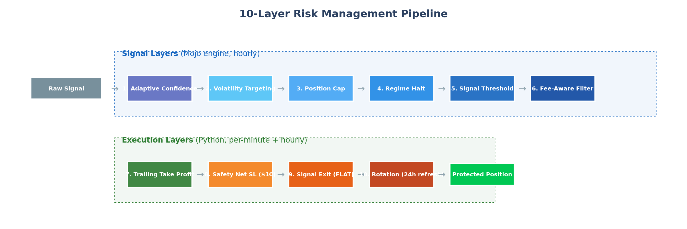
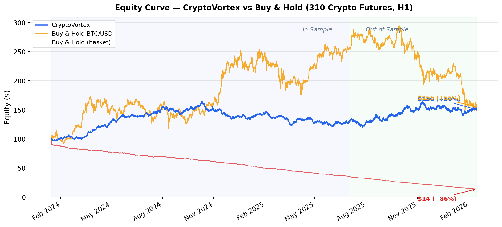
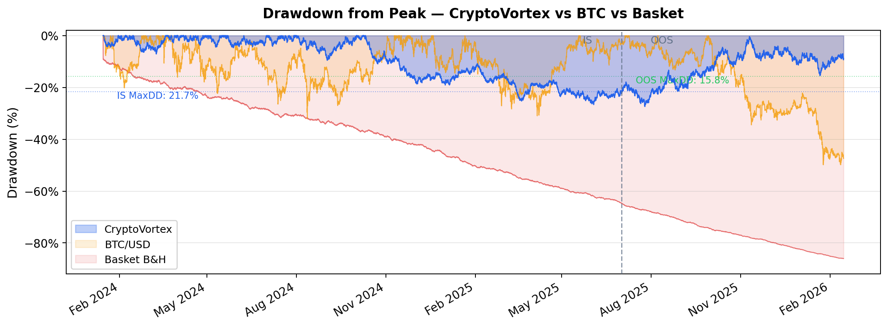
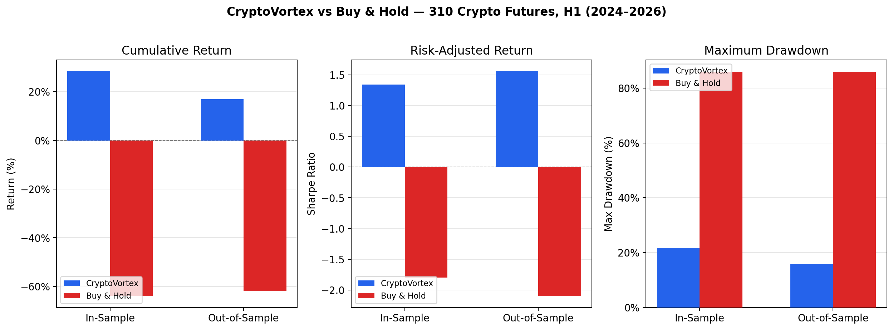
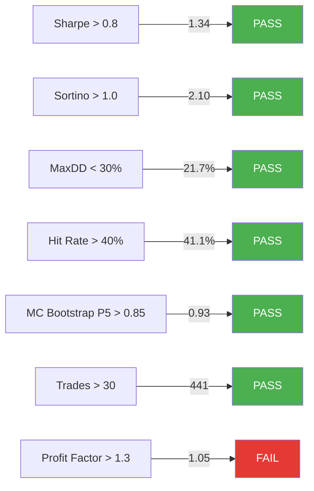

# CryptoVortex — Automated Crypto Futures Strategy

> **Independent research project** developed during the author's MSc in
> Financial Engineering at [WorldQuant University](https://www.wqu.edu/),
> combining applied algebraic topology and computational finance.
> Not reviewed or endorsed by WQU. Shared for educational purposes only.
>
> **Author:** [Remi Roche](https://www.linkedin.com/in/rremife)

---

## What is CryptoVortex?

CryptoVortex applies **Topological Data Analysis (TDA)** to the cross-sectional
structure of ~180 cryptocurrency futures. Persistent topological features in
high-dimensional return spaces detect structural regime shifts that carry
directional information — validated over 2 years (2024-2026) and deployed
live on DeFi (Decentralized Finance) broker: [Hyperliquid](https://hyperliquid.xyz).

**In plain terms:** the strategy reads the *shape* of the market, not just
prices. When 180 altcoins move in a way that creates a detectable topological
pattern, the system takes a directional bet and captures profits via an
automated trailing mechanism.

For the full technical treatment, see
[CryptoVortex Overview (PDF)](docs/CryptoVortex_Overview.pdf).

| | |
|---|---|
| **Timeframe** | H1 (hourly) |
| **Universe** | ~180 Hyperliquid USDC perps |
| **Direction** | Long / Short / Flat |
| **Leverage** | 4x |
| **Capital** | $100 |
| **Automation** | Hourly cron + 1-minute heartbeat, Docker |

---

## Live Performance (March 2026)

### The Journey: From -21% to +6%

**Week 1 — Calibration (Mar 4-15)**

Deployed with a mechanical stop loss validated on 2 years of backtested data.
Lost 21% in 10 days. The SL triggered 6x more frequently in live than the
backtest predicted — intra-bar volatility on leveraged altcoins is noise, not
signal. Account reset to $100.

<p align="center">
  <br>
  <em>Week 1: Layer 7 (mechanical SL) was the primary cause of losses.</em>
</p>

**Week 2-3 — Trailing Take Profit (Mar 15-28)**

Redesigned the exit mechanism entirely. Instead of cutting losses mechanically,
the system now captures gains before they evaporate via a per-exchange trailing
take profit.

| | Hyperliquid |
|---|---|
| Start | $100 |
| Current | $112.46 |
| **Return** | **+12.5%** |
| TP captures | 11 |

<p align="center">
  <br>
  <em>Full history: pre-reset losses (left of orange line) vs post-reset recovery. Bottom: drawdown from peak.</em>
</p>

<p align="center">
  <br>
  <em>Unrealized PnL with trailing captures (arrows). Activation at $3, close on $1 drop from peak.</em>
</p>

<p align="center">
  <br>
  <em>Daily peak/trough. Grey = pre-reset. Colored = post-reset.</em>
</p>

**Key insights from live trading:**

- Trailing TP is the sole profit driver — rotations close at a loss (residual)
- ~50% of gross profits eaten by execution costs (spread, slippage, fees)
- No SL outperforms every SL config tested — market mean-reverts after spikes
- Weekend paper trading avoids Friday-Sunday manipulation risk

> Detailed reports:
> [Performance Report](docs/Hyperliquid_Performance.pdf) |
> [SL Analysis](docs/SL_Analysis_Mar25.pdf) |
> [Weekly Report](docs/Weekly_Report_Mar15-22.pdf)

*Real trading results, not backtested. Past performance does not guarantee future results.*

---

## How It Works

### Architecture



### Signal Engine (Mojo)

Written in [Mojo](https://www.modular.com/mojo) — not by preference, by
necessity. The TDA pipeline must process 13,000+ hourly bars across 180
assets every hour. With Python, hourly execution is impossible:

| | Mojo | Python (estimated) |
|---|---|---|
| Compilation | ~40s | 0s |
| CSV read (3.5M rows) | ~10s | ~5s (pandas) |
| TDA pipeline (13K bars) | ~160s (~12ms/bar) | ~13,000-26,000s (~1-2s/bar) |
| **Total** | **~3.5 min** | **~4-8 hours** |

The entire pipeline — from reading 500+ CSV files via a custom
[CSV reader](src/mojo/csv_reader.mojo) to computing the trading signal —
runs in a single compiled language with no pandas dependency and zero
serialization overhead.

### Risk Management

<p align="center">
  <br>
  <em>6 signal layers (Mojo) + 4 execution layers (Python).</em>
</p>

**Trailing Take Profit** (primary mechanism):

1. Unrealized PnL reaches $3 → activate peak tracking
2. Every minute: update peak if higher
3. PnL drops $1 from peak → close all positions on that exchange
4. 2-hour cooldown before re-entry

**Why no tight stop loss?** Systematic testing on 10+ days of real data
showed that removing the SL produces both higher returns AND lower drawdowns.
See [full analysis](docs/SL_Analysis_Mar25.pdf).

**Additional layers:** Anti-liquidation SL ($30), signal-based FLAT exit,
24h rotation, per-exchange isolation, automated weekend paper trading,
shadow config tracking for continuous optimization.

---

## Backtested Performance

309 assets, ~10,500 H1 bars (Jan 2024 - Feb 2026), $100 capital, 1x leverage.

> The backtest uses 1x leverage with a trailing stop — different from the
> live config (4x, trailing TP). The signal engine is the same; the execution
> layer was redesigned based on live observations.

<p align="center">
  <br>
  <em>Strategy vs Buy & Hold BTC and altcoin basket.</em>
</p>

| Metric | In-Sample | Out-of-Sample |
|--------|-----------|---------------|
| Sharpe | 1.34 | 1.56 |
| Sortino | 2.10 | 2.45 |
| Max drawdown | 21.7% | 15.8% |
| Return | +28.5% | +17.0% |

<details>
<summary>More backtest details</summary>

<p align="center">
  <br>
  
</p>

**Market context:** The backtest covers a crypto winter for altcoins. BTC
gained 56% while the altcoin basket lost 86%. CryptoVortex detected the
regime shift topologically and went predominantly short.

</details>

### Validation

> Applies to the TDA signal engine (Layers 1-6), not the live execution config.



*6/7 gates pass (in-sample). Walk-forward: 3/5 folds positive. Reversed chronology retains 82% of Sharpe.*

---

## Quick Start

```bash
git clone https://github.com/remroc/public_cryptovortex.git
cd public_cryptovortex
cp .env.example .env          # Add API keys
docker compose build
docker compose run --rm engine bash scripts/setup.sh
docker compose up -d
```

Monitor:
```bash
tail -f logs/heartbeat.log     # Live PnL
cat logs/rotations.csv         # Rotation history
cat data/hyperliquid/signal.txt  # Current signal
```

## Configuration

```yaml
defaults:
  stop_loss_usd: 30.0             # Anti-liquidation only
  trailing_tp:
    activation_usd: 3.0           # Trail activates at $3
    trail_drop_usd: 1.0           # Close on $1 drop from peak
    cooldown_minutes: 120          # 2h cooldown after close
exchanges:
  hyperliquid:
    capital_usd: 100
    leverage: 4
    top_n: 4
```

---

## Disclaimer

**This software is provided "as is", without warranty of any kind.** Trading
cryptocurrency futures involves substantial risk of loss. You can lose some or
all of your invested capital. This is not financial advice. Do not trade with
money you cannot afford to lose.

## License

Proprietary. All rights reserved. Academic use only.
